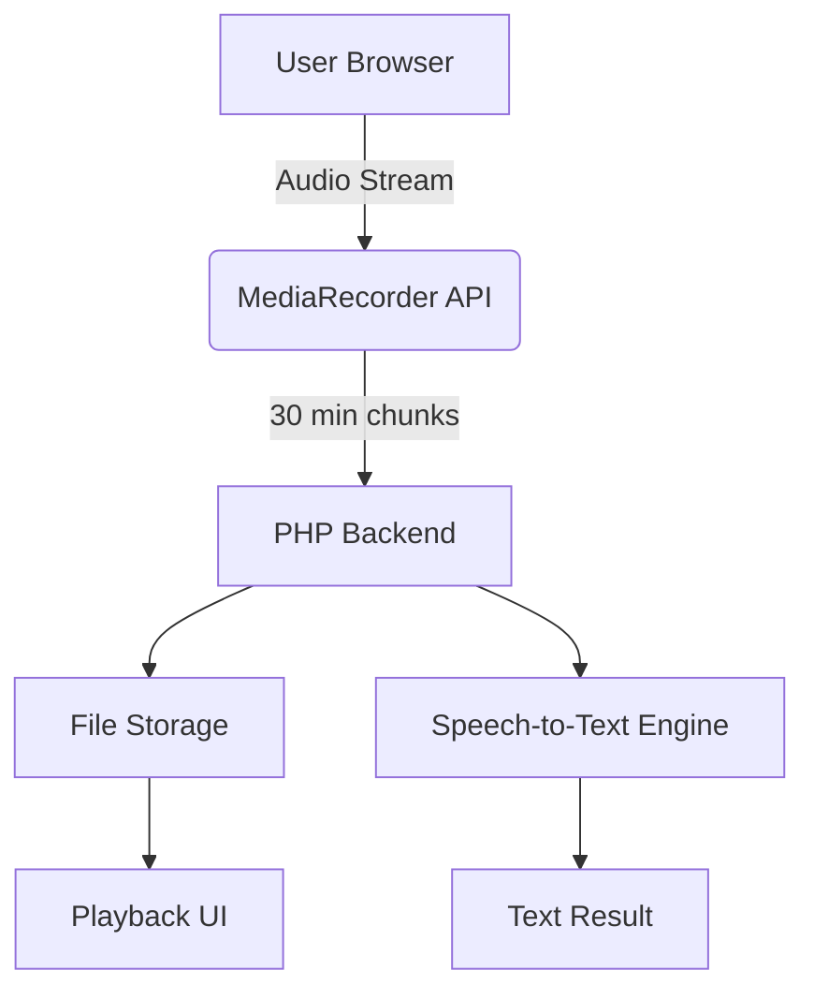
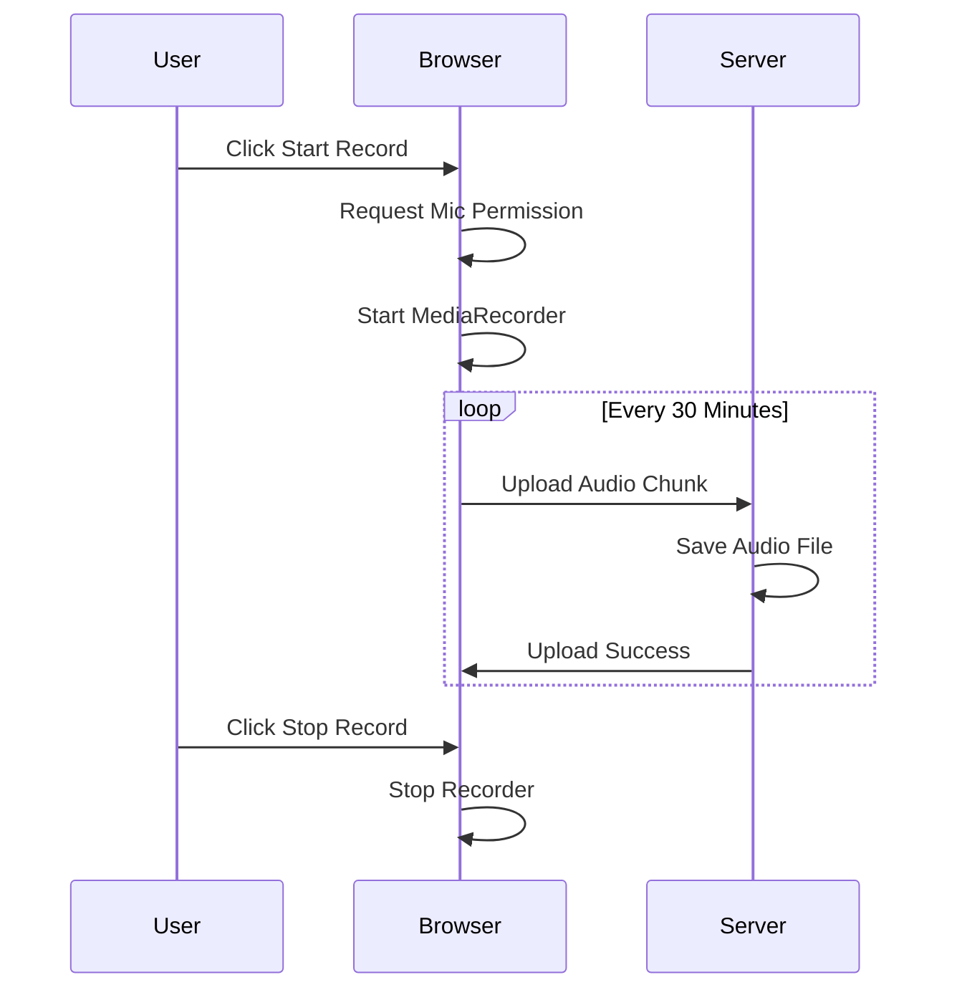
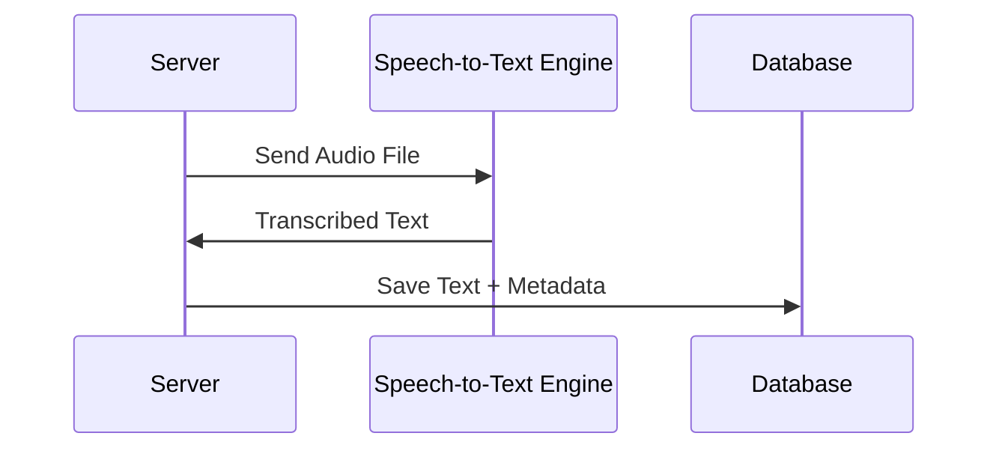

# 🎙️ Web Voice Recorder & Speech-to-Text

A **web-based voice recording application** that records audio directly from the browser, **automatically splits recordings every 30 minutes**, stores them on the server, and **converts audio to text (Speech-to-Text)**.

This project is designed for **long-duration recording** use cases such as monitoring, logging, interviews, and documentation — **without additional hardware**, using only a modern browser.

---

## ✨ Key Features

* 🎤 Browser-based audio recording (no plugin, no hardware)
* ⏱️ Automatic audio split every **30 minutes**
* 💾 Server-side storage (PHP)
* ▶️ Playback recorded audio directly from the web UI
* 📝 Speech-to-Text conversion (Whisper / Google / Vosk – pluggable)
* 📅 Recording history with date & time
* 🔐 Secure microphone permission (HTTPS)

---

## 🎯 Application Goals

* Enable **continuous audio recording** via web browser
* Prevent large file issues by **auto-splitting audio**
* Provide **structured audio logs** with timestamps
* Convert voice recordings into **searchable text data**
* Reduce dependency on desktop/mobile native apps

---

## 🧩 Use Cases

### 1️⃣ Voice Logging / Monitoring

* Control room monitoring
* Operational voice logs
* Shift handover documentation

### 2️⃣ Meeting & Interview Recording

* Long meetings (>1 hour)
* Interviews
* Research data collection

### 3️⃣ Voice-based Documentation

* Field reporting
* Verbal daily reports
* Knowledge capture

### 4️⃣ Speech-to-Text Automation

* Convert voice → text for analysis
* Index & search spoken content
* Integration with reporting systems

---

## 🏗️ System Architecture

### High-Level Architecture



---

## 🔁 Recording Flow



---

## 📝 Speech-to-Text Flow



---

## 🛠️ Technology Stack

### Frontend

* HTML5
* CSS
* JavaScript
* MediaRecorder API

### Backend

* PHP 7+
* File-based storage or Database (optional)

### Audio

* Format: `audio/webm (Opus)`
* Bitrate: 24–32 kbps

### Speech-to-Text (Optional)

* OpenAI Whisper
* Google Speech-to-Text
* Vosk (offline)

---

## 📁 Project Structure

```
web-voice-recorder/
│
├── index.php          # UI + Recorder
├── upload.php         # Handle audio upload
├── list.php           # Display recordings
├── transcribe.php     # Speech-to-text process
│
├── recordings/
│   └── 2026-01-20/
│       ├── audio_08-00_part1.webm
│       └── audio_08-30_part2.webm
│
└── README.md
```

---

## ⚠️ Requirements & Limitations

* ✅ HTTPS required (except localhost)
* ✅ User interaction required (Start button)
* ❌ Browser tab must remain open
* ❌ Not suitable for background recording on mobile

---

## 📊 Storage Estimation

| Duration | Bitrate | File Size |
| -------- | ------- | --------- |
| 30 min   | 32 kbps | ~43 MB    |
| 1 hour   | 32 kbps | ~86 MB    |
| 24 hour  | 32 kbps | ~2 GB     |

---

## 🔐 Security Considerations

* Microphone access requires explicit user consent
* HTTPS enforced by browser
* Server-side validation on uploads
* Optional authentication layer

---

## 🚀 Future Enhancements

* ⏯ Resume recording after refresh
* 🧠 Silence detection
* 🔎 Full-text search on transcription
* ☁️ Cloud storage (S3 / GCS)
* 📊 Analytics dashboard
* 👥 Multi-user support

---

## 📜 License

MIT License

---

## 👤 Author

Developed for **web-based long-duration voice recording & transcription use cases**.

---

⭐ If this project helps you, feel free to give it a **star** on GitHub!
